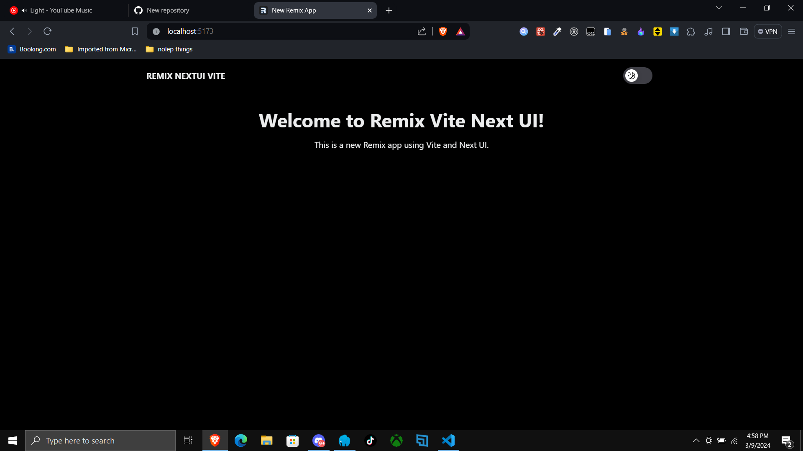

# Welcome to Remix + Vite + NextUI + Cloudflare

📖 See the [Remix docs](https://remix.run/docs) and the [Remix Vite docs](https://remix.run/docs/en/main/future/vite) for details on supported features.

## Getting Started

```shellscript
npx create-remix@latest --template https://github.com/dodycode/remix-nextui-cloudflare
```

## Built in theme switcher



## Development

Run the Vite dev server:

```sh
npm run dev
```

## Deployment

First, build your app for production:

```sh
npm run build
```

Setup your environment:

```sh
NODE_ENV='production'
```

Then run the app in production mode:

```sh
npm start
```

Now you'll need to pick a host to deploy it to.

### DIY

If you're familiar with deploying Node applications, the built-in Remix app server is production-ready.

Make sure to deploy the output of `npm run build` and the server

- `server.js`
- `build/server`
- `build/client`

Take a look at the provided Dockerfile for further details on how to configure a production environment.
